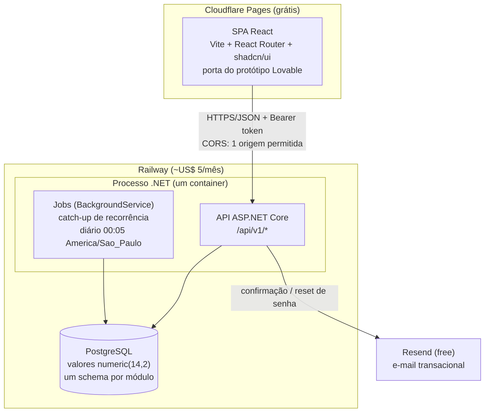
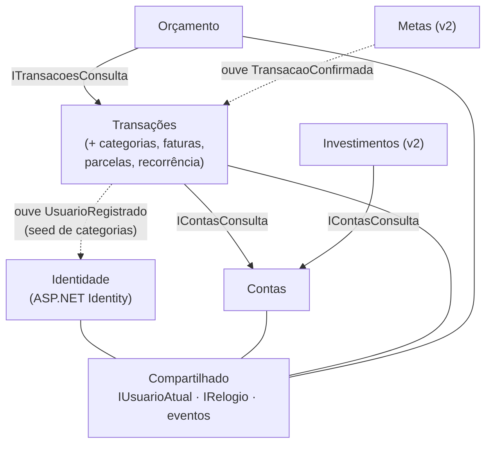
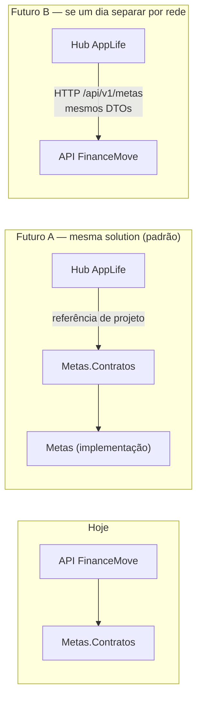

# Arquitetura — FinanceMove (monólito modular)

> Complementa o `ADR-001-arquitetura.md` (decisões e porquês). Aqui está o desenho:
> componentes, fronteiras dos módulos e a interface do módulo Metas para o futuro AppLife.

## 1. Visão de componentes



Pontos que o diagrama não mostra sozinho:

- **Jobs rodam no MESMO processo da API** (`BackgroundService`), não num worker separado — no nosso
  volume, um processo basta, e a lógica do job pertence ao módulo Transações de qualquer forma. Se o
  AppLife um dia precisar de worker dedicado, o módulo se move sem reescrita.
- O catch-up de recorrência também roda **na primeira requisição autenticada do dia** de cada usuário
  (idempotente — SPEC §5.5), então o job diário é rede de segurança, não dependência.
- O relógio é **injetável** (`IRelogio` no Compartilhado): todo código que pergunta "que dia é hoje?"
  usa essa abstração, o que viabiliza a verificação fim-a-fim da SPEC §10 (`TEST_TODAY`).

## 2. As regras do monólito modular

Fronteira que não é imposta pelo compilador vira sugestão. Por isso:

1. **Um módulo = dois projetos:** `Modulos/X/X.csproj` (implementação, tudo `internal`) e
   `Modulos/X/X.Contratos.csproj` (interfaces públicas + DTOs + eventos). 
2. **Módulo nunca referencia a implementação de outro** — só o `.Contratos`. O compilador recusa o
   atalho.
3. **Nenhum módulo lê ou escreve tabela de outro.** Cada módulo tem seu próprio `DbContext` e seu
   próprio **schema no Postgres** (`identidade.*`, `contas.*`, `transacoes.*`, `orcamento.*`...).
   Join entre módulos não existe; composição acontece na camada de aplicação, via contratos.
4. **Comunicação:** síncrona = chamar a interface pública do outro módulo (via DI); desacoplada =
   **eventos de domínio in-process** (ex.: `UsuarioRegistrado`, `TransacaoConfirmada`) — o publicador
   não sabe quem ouve.
5. **`Compartilhado` é mínimo:** `IUsuarioAtual`, `IRelogio`, barramento de eventos, tipos de erro da
   API. Se algo "de negócio" quiser morar ali, é sinal de fronteira errada.



Setas cheias = dependência de contrato (chamada síncrona). Tracejadas = assinatura de evento.
Note a direção: **Orçamento depende de Transações, nunca o contrário** — Transações não sabe que
orçamento existe.

## 3. Fronteiras módulo a módulo

| Módulo | Possui (schema/tabelas) | Expõe (contrato público) | Consome | Publica eventos |
|---|---|---|---|---|
| **Identidade** | `identidade.*` (tabelas do ASP.NET Identity) | endpoints de auth; `UsuarioDto` | — | `UsuarioRegistrado`, `UsuarioExcluido` |
| **Contas** | `contas.conta` | `IContasConsulta`: conta existe/é do usuário, `ContaResumoDto`, ciclo do cartão (fechamento/vencimento) | — | `ContaCriada` |
| **Transações** | `transacoes.transacao`, `.categoria`, `.regra_recorrencia`, `.grupo_parcelamento` | `ITransacoesConsulta`: saldo por conta, somas por categoria/mês, fatura do mês | `IContasConsulta` | `TransacaoConfirmada` |
| **Orçamento** | `orcamento.orcamento` | `IOrcamentoConsulta`: progresso do mês por categoria | `ITransacoesConsulta` | — |
| **Metas** (v2) | `metas.meta`, `.aporte_meta` | `IMetasApi` (ver §5) | `ITransacoesConsulta` (opcional) | `MetaCriada`, `MetaAtingida` |
| **Investimentos** (v2) | `investimentos.ativo`, `.movimento`, `.snapshot` | `IInvestimentosConsulta`: posição consolidada | `IContasConsulta` | — |

Duas decisões de fronteira que merecem o porquê:

- **Categorias moram em Transações**, não num módulo próprio: categoria só existe para classificar
  lançamentos. Orçamento referencia `categoria_id` mas valida via contrato de Transações. O seed de
  categorias no cadastro é o exemplo canônico de evento: Identidade publica `UsuarioRegistrado`,
  Transações ouve e cria o seed — Identidade não sabe que categorias existem.
- **Saldo e fatura são calculados em Transações** (dono dos lançamentos), usando o `saldo_inicial` e
  o ciclo do cartão obtidos de `IContasConsulta`. Contas guarda o cadastro; Transações guarda os
  fatos; o número derivado sai de quem tem os fatos.
- **Exclusão de conta de usuário (LGPD, US-13):** Identidade publica `UsuarioExcluido`; cada módulo
  apaga o que é seu. Nenhum módulo apaga dados de outro.

## 4. Módulo Metas: a interface para o AppLife

O AppLife vai querer mostrar "suas metas de vida" misturando metas financeiras (FinanceMove) com
hábitos e treinos. A regra que torna isso barato no futuro: **o AppLife só conhece
`Metas.Contratos` — nunca tabelas, nunca classes internas.**

```csharp
// Modulos/Metas/Metas.Contratos/IMetasApi.cs
public interface IMetasApi
{
    Task<IReadOnlyList<MetaResumoDto>> ListarAsync(Guid usuarioId, CancellationToken ct);
    Task<MetaResumoDto?> ObterAsync(Guid usuarioId, Guid metaId, CancellationToken ct);
}

public record MetaResumoDto(
    Guid Id,
    string Nome,
    decimal ValorAlvo,
    decimal ValorAcumulado,
    decimal PercentualConcluido,   // calculado no servidor — o front não faz conta
    DateOnly? Prazo,
    decimal? SugestaoMensal);      // quanto guardar/mês para chegar no prazo

// Eventos que o AppLife poderá ouvir (in-process):
public record MetaAtingida(Guid UsuarioId, Guid MetaId, string Nome) : IEventoDominio;
```

Os dois caminhos de absorção, já previstos:



- **Caminho A (o esperado):** os projetos do FinanceMove entram na solution do AppLife; o hub
  referencia `Metas.Contratos` e chama `IMetasApi` in-process. Nada muda no FinanceMove.
- **Caminho B (seguro de vida):** os endpoints `/api/v1/metas` já devolvem exatamente os DTOs do
  contrato; se a separação por rede algum dia se justificar, o shape da integração já existe.
- Vale igual para os outros módulos: `ITransacoesConsulta` é o que permitirá ao AppLife mostrar
  "quanto gastei com alimentação" ao lado do módulo de dieta — sem tocar no banco do financeiro.

## 5. Autenticação e isolamento (resumo operacional)

- Login → **access token** (~15 min, mantido em memória na SPA) + **refresh token** com rotação
  (refresh usado = invalidado e trocado) e revogação server-side; expiração de 7 dias.
- CORS: allowlist com a única origem do Cloudflare Pages; nada de `*`; preflight cacheado.
- Isolamento multi-tenant: Global Query Filter do EF injeta `usuario_id = @sessão` em toda query de
  todo módulo; recurso alheio → 404. Detalhes e camadas extras no ADR-001, Decisão 2.

## 6. O que este desenho NÃO tem (de propósito)

- **Microserviços, filas externas, cache distribuído** — volume não justifica; o modular monolith dá
  as fronteiras sem o custo operacional.
- **Gateway/BFF** — a SPA fala direto com a única API.
- **Snapshot de saldo** — saldo é sempre derivado (SPEC D4); a soma custa milissegundos no volume alvo.
