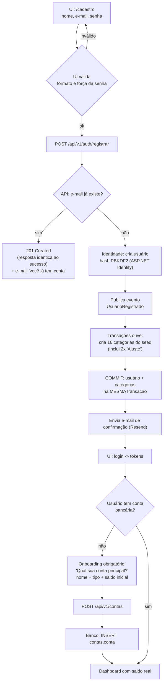
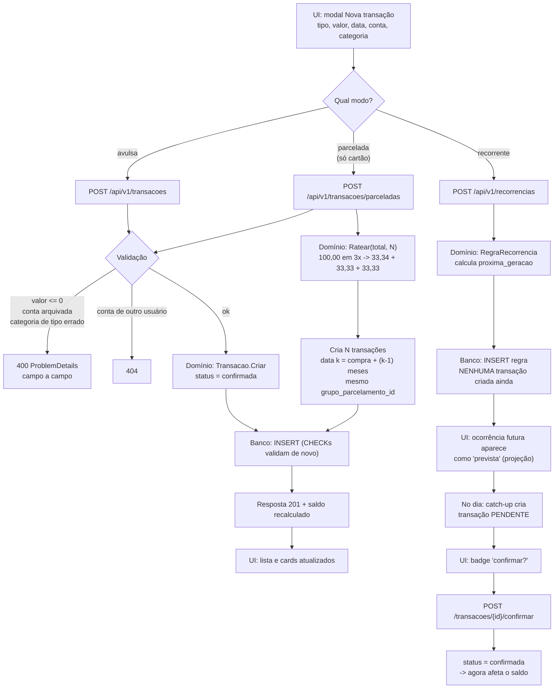
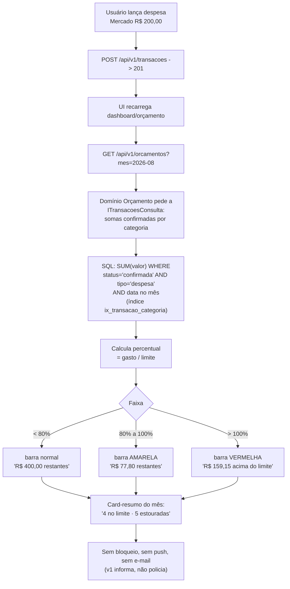
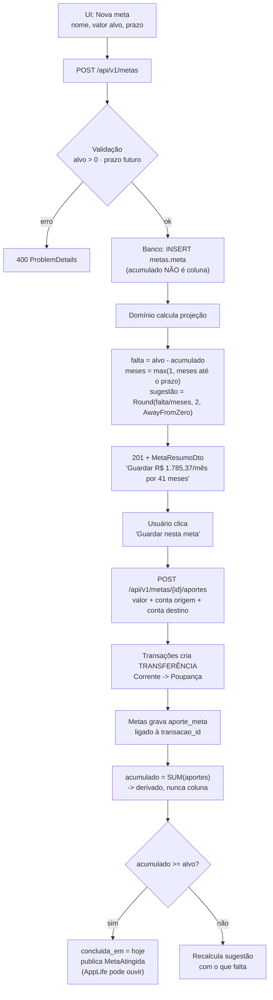
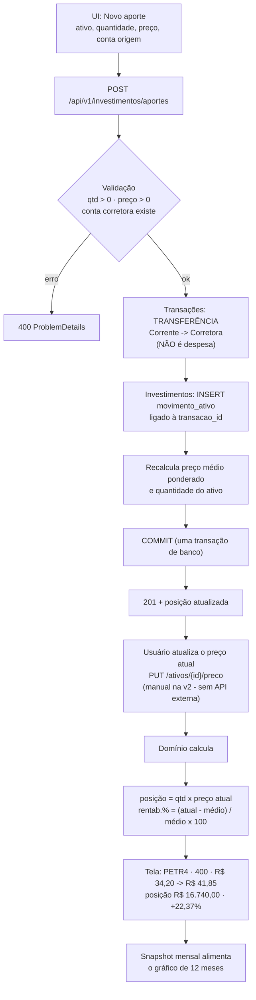

# Fluxos de usuário - FinanceMove

> Cinco jornadas críticas, cada uma com diagrama e o passo a passo em **todas as camadas**:
> UI (SPA React) -> API (ASP.NET) -> validação -> banco (Postgres) -> resposta.
> Base: `SPEC.md`, `docs/ADR-001-arquitetura.md`, `docs/modelo-de-dados.md`.
> Contratos exatos de rota e payload: `docs/api.md`.

**Legenda de camadas usada em todo o documento**

| Camada | Onde vive | Responsabilidade |
|---|---|---|
| **UI** | SPA Vite (Cloudflare Pages) | formulário, formatação pt-BR, estado de tela. **Nunca faz conta de dinheiro** |
| **API** | Controller/Endpoint (`Api`) | HTTP, auth, tradução DTO <-> comando |
| **Validação** | FluentValidation + regras de domínio no módulo | formato -> regra de negócio -> invariante |
| **Domínio** | Módulo (`Contas`, `Transacoes`, ...) | a decisão em si; único lugar que calcula dinheiro |
| **Banco** | Postgres | persistência + CHECKs + índices (a última tranca) |

Regra transversal em todos os fluxos: toda query filtra por `usuario_id` da **sessão** (Global Query
Filter do EF). Recurso de outro usuário responde **404**, nunca 403 (SPEC US-14).

---

## 1. Cadastro e primeiro acesso (onboarding)

O momento mais frágil do app: se a pessoa chega ao dashboard vazio sem saber o que fazer, ela vai
embora. Por isso o onboarding termina com **uma conta bancária criada e um saldo na tela**.



### Passo a passo por camada

1. **UI** - formulário de cadastro. Valida formato de e-mail e senha (mín. 8 caracteres). Validação de
   cliente é conveniência, não segurança: tudo é revalidado no servidor.
2. **API** - `POST /api/v1/auth/registrar`. Endpoint **anônimo** e sob rate limit (5 tentativas por IP
   por minuto).
3. **Validação** - `NomeObrigatorio`, `EmailValido`, `SenhaMinima`. Se o e-mail já existe, a API
   responde **201 do mesmo jeito** e dispara um e-mail avisando que já há conta. Isso se chama evitar
   *user enumeration*: se respondêssemos "e-mail já cadastrado", qualquer um descobriria quem usa o app.
4. **Domínio (Identidade)** - `UserManager.CreateAsync` gera o hash PBKDF2. Nenhuma linha de
   criptografia escrita à mão (ADR Decisão 5). Publica `UsuarioRegistrado`.
5. **Domínio (Transações)** - o handler do evento cria o seed do Apêndice A: 11 categorias de despesa,
   3 de receita e **duas** "Ajuste" (uma receita, uma despesa - decisão de 15/08/2026).
6. **Banco** - usuário e categorias são gravados na **mesma transação de banco**. Se o seed falhar, o
   cadastro inteiro volta atrás; nunca existe usuário sem categorias.
7. **Resposta** - `201 Created`. A UI faz login e guarda o access token **em memória** (nunca
   `localStorage`, que é lido por qualquer XSS); o refresh token vem em cookie `httpOnly`.
8. **Onboarding** - o dashboard checa `GET /api/v1/contas`. Lista vazia dispara o passo obrigatório
   "crie sua conta principal" (nome, tipo, saldo inicial). Sem conta, não há onde lançar despesa -
   por isso é bloqueante, não um convite ignorável.
9. **Confirmação de e-mail** - não bloqueia o uso na v1 (o cadastro é por convite). Vira bloqueio no
   portão de abertura pública (SPEC secao 9.4).

**Critérios de aceite atendidos:** US-01 (cadastro/login/lockout) e US-08 (seed de categorias).

---

## 2. Registrar uma despesa (avulsa, parcelada ou recorrente)

O caminho mais percorrido do app - precisa custar menos de 10 segundos (US-03).



### Passo a passo por camada

1. **UI** - modal com abas despesa/receita/transferência. Valor aceita vírgula (`"150,00"`), data
   padrão hoje. Se a conta escolhida for cartão, aparece o campo "parcelas".
2. **API** - três rotas distintas porque são três operações diferentes de domínio (uma transação, N
   transações, ou nenhuma transação + uma regra). Uma rota só com flags viraria um `if` gigante.
3. **Validação** -
   - formato: valor > 0, data válida, descrição <= 120 caracteres;
   - negócio: conta existe **e é do usuário** (via `IContasConsulta` - Transações não lê a tabela de
     Contas, ADR Decisão 2); conta não arquivada; categoria do mesmo tipo da transação (não se
     classifica despesa com categoria de receita); transferência exige destino != origem e **sem**
     categoria; parcelamento só em `cartao_credito`, entre 2 e 48 parcelas.
4. **Domínio** - o valor é `decimal`, sempre positivo; o sinal vem do tipo. Parcelamento usa
   `Ratear` (modelo-de-dados secao 4.4), cuja invariante é `soma parcelas == total`. Data da parcela `k` é
   `compra + (k-1) meses`; se o dia não existir no mês de destino (compra em 31/01 -> parcela em
   fevereiro), cai no **último dia do mês**.
5. **Banco** - `INSERT`. Os `CHECK` de `ck_transacao_forma` e `ck_transacao_valor` são a última tranca:
   mesmo um bug futuro na aplicação não consegue gravar "transferência com categoria".
6. **Resposta** - `201` com a transação criada e o saldo recalculado da conta (a UI não soma nada).
7. **Recorrência** - criar a regra **não cria transação**. O catch-up (modelo-de-dados secao 4.2) materializa
   uma transação `pendente` quando a data chega, dentro de uma transação de banco com
   `FOR UPDATE SKIP LOCKED` - abrir o app duas vezes não duplica (SPEC secao 10, passo 8). Pendente **não**
   entra no saldo nem no orçamento até o usuário confirmar; ao confirmar, ele pode ajustar o valor
   (conta de luz varia todo mês).

**Critérios de aceite atendidos:** US-03, US-04, US-06, US-07.

---

## 3. Estourar o orçamento de uma categoria

A pergunta do briefing: *o que o usuário vê?* Resposta desta v1: **o app informa, não policia** (SPEC
secao 5.7) - nada é bloqueado e nenhuma notificação é enviada.



### Passo a passo por camada

1. **UI** - a tela de Orçamento do protótipo já implementa exatamente isto: barra por categoria,
   percentual no canto, texto "R$ X restantes" ou "R$ X acima do limite", e o card-resumo do mês.
   As três cores vêm de um campo `situacao` que a API devolve - **a UI não decide faixa**, para a regra
   morar num lugar só.
2. **API** - `GET /api/v1/orcamentos?mes=2026-08` devolve, para cada orçamento: categoria, limite,
   gasto, percentual e situação (`normal` | `atencao` | `estourado`).
3. **Domínio (Orçamento)** - **não lê a tabela de transações**: pede as somas por
   `ITransacoesConsulta.SomarDespesasPorCategoria(usuarioId, mes)`. É a fronteira do ADR na prática, e
   a direção da dependência está correta (Orçamento -> Transações; Transações nem sabe que orçamento
   existe).
4. **Banco** - uma query agregada por mês, servida pelo índice parcial
   `ix_transacao_categoria ... WHERE status = 'confirmada'`.
5. **O que entra na conta:** apenas despesas **confirmadas** com data no mês calendário. Ficam de fora
   transferências (D6 - pagar fatura não é gasto novo) e pendências de recorrência não confirmadas.
   Despesa de cartão conta pelo **mês da compra**, não pelo do pagamento (regime de competência).
6. **Estouro** - passar de 100% muda a cor e o texto. Nada mais. Alerta ativo (e-mail/push ao cruzar
   80%) está registrado como v3 na SPEC; entrar agora exigiria fila e preferências de notificação.

**Critério de aceite atendido:** US-09.

---

## 4. Criar uma meta e receber a sugestão de "guardar R$ X/mês" *(v2)*

> Módulo **Metas** é v2 na SPEC. O fluxo está desenhado agora porque define as tabelas do
> modelo-de-dados secao 2.1 e porque é a interface que o **AppLife** vai consumir (arquitetura.md secao 4).



### A fórmula (pedida explicitamente)

```
falta = valor_alvo - acumulado
meses_restantes = max(1, meses inteiros entre hoje e prazo)
sugestao_mensal = Round(falta / meses_restantes, 2, MidpointRounding.AwayFromZero)
percentual = Round(acumulado / valor_alvo x 100, 1)
```

Conferindo com o card "Apartamento" do seu protótipo:

```
alvo = 120.000,00 acumulado = 46.800,00 prazo = 31/12/2029 hoje = jul/2026
falta = 120.000,00 - 46.800,00 = 73.200,00
meses = (2029-2026)x12 + (12-7) = 41
sugestão = 73.200,00 / 41 = 1.785,3658... -> R$ 1.785,37 ok (bate com a tela)
percentual= 46.800 / 120.000 x 100 = 39,0% ok
```

Casos-limite tratados: **sem prazo** -> não há sugestão, só percentual; **prazo vencido** com meta não
atingida -> `meses_restantes = 1` e a UI mostra "prazo vencido"; **meta já atingida** -> sugestão zero.
Juros/rendimento não entram na projeção da v2 (seria valor futuro de série; fica como v2.1) - a
sugestão é deliberadamente conservadora: se o dinheiro render, você chega antes.

### Passo a passo por camada

1. **UI** - formulário com nome, valor alvo, prazo (opcional), cor e ícone.
2. **API** - `POST /api/v1/metas`; a resposta já traz a projeção calculada, porque **a UI não faz conta
   de dinheiro**.
3. **Validação** - alvo > 0; prazo, se informado, no futuro; nome único por usuário.
4. **Domínio** - `acumulado` **não é coluna**: é `SUM(aporte_meta.valor)`. Mesmo princípio do saldo
   (modelo-de-dados secao 4.3) - número derivado não dessincroniza.
5. **Aporte** - "guardar" é uma **transferência real** entre contas (decisão de 15/08/2026) com um
   `aporte_meta` ligando à transação. O dinheiro se move de verdade, não vira despesa (D6), e uma
   mesma conta poupança pode servir a várias metas.
6. **AppLife** - `IMetasApi.ListarAsync` devolve o `MetaResumoDto` com `PercentualConcluido` e
   `SugestaoMensal` já calculados, e `MetaAtingida` é publicado como evento. O hub consome o contrato
   sem tocar em tabela nenhuma do financeiro.

---

## 5. Registrar um aporte de investimento e ver a rentabilidade *(v2)*

> Também v2. Corrige de saída o erro do mock do protótipo, que contava "Aporte investimentos
> -R$ 2.401,89" como **despesa** - inflando o gasto do mês. Aporte não é gasto: é dinheiro mudando de
> bolso.



### As fórmulas

```
preco_medio = soma(quantidade_aporte x preco_unitario) / soma(quantidade_aporte) -- resgate NÃO altera o médio
posicao = Round(quantidade x preco_atual, 2)
rentabilidade% = Round((preco_atual - preco_medio) / preco_medio x 100, 2)
```

Conferindo com a linha PETR4 do seu protótipo:

```
qtd = 400 médio = 34,20 atual = 41,85
posição = 400 x 41,85 = R$ 16.740,00 ok
rentab. = (41,85 - 34,20) / 34,20 x 100 = 22,368...% -> +22,37% ok
```

Segundo aporte muda o médio (é média **ponderada**, não simples):

```
400 x 34,20 = 13.680,00 +      100 x 40,00 = 4.000,00
preço médio = 17.680,00 / 500 = R$ 35,36
```

### Passo a passo por camada

1. **UI** - formulário: ativo (novo ou existente), quantidade, preço unitário, data, conta de origem.
2. **API** - `POST /api/v1/investimentos/aportes`, uma operação que atravessa dois módulos.
3. **Validação** - quantidade e preço > 0; a conta destino precisa existir (tipicamente uma conta
   "Corretora" do tipo `corrente`); ativo pertence ao usuário.
4. **Domínio** - o aporte gera **duas** escritas na mesma transação de banco: a transferência (módulo
   Transações, via contrato) e o `movimento_ativo` (módulo Investimentos). Se qualquer uma falhar, nada
   é gravado - impossível ficar com movimento sem dinheiro saindo da conta.
5. **Precisão** - `quantidade` e `preco_unitario` são `numeric(18,8)`, porque 0,085 BTC não cabe em duas
   casas. Só o **resultado em reais** (posição, patrimônio) é `numeric(14,2)`.
6. **Preço atual** - atualizado **manualmente** na v2 (ADR: cobre toda classe de ativo; CDB, Tesouro e
   fundos não têm API gratuita mesmo). Cotação automática para bolsa via brapi é v2.1 opcional.
7. **Evolução do patrimônio** - `snapshot_ativo` grava a posição no primeiro dia de cada mês; é o que
   alimenta o gráfico de 12 meses sem recalcular histórico a cada abertura de tela.

---

## 6. Padrões comuns a todos os fluxos

| Tema | Regra |
|---|---|
| Erro | Sempre `ProblemDetails` (RFC 9457) com `traceId` - ver `docs/api.md` secao 3 |
| Recurso alheio | **404**, nunca 403 (não vazar existência) |
| Dinheiro | Calculado no servidor; a UI só formata com `Intl.NumberFormat('pt-BR')` |
| "Hoje" | `IRelogio.HojeSaoPaulo()`, jamais `DateTime.Now` |
| Escrita que cruza módulos | Uma única transação de banco (aporte, pagamento de fatura, seed no cadastro) |
| Operação repetida | Idempotente por desenho (catch-up de recorrência; pagar fatura já paga -> 409) |
