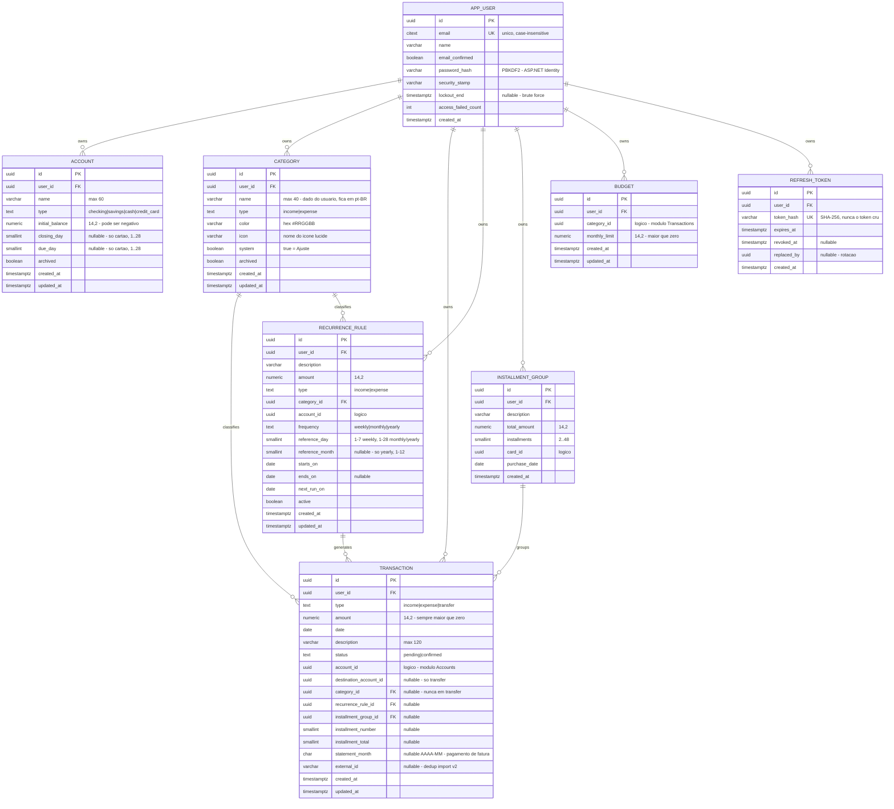
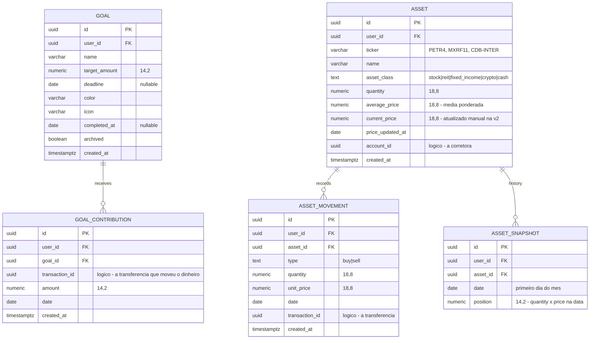

# Modelo de dados - FinanceMove

> Base: `SPEC.md` (regras de negócio) e `docs/ADR-001-arquitetura.md` (decisões técnicas).
> Banco: PostgreSQL. ORM: EF Core (Npgsql). Migrations versionadas - o banco nunca é alterado à mão.
> **Idioma:** a documentação é pt-BR, mas **todo identificador é em inglês** (schemas, tabelas, colunas,
> classes, rotas, campos JSON). Só permanecem em português os **dados de usuário** - nomes de
> categorias do seed, descrições de transações - porque são exibidos na UI pt-BR.
> Tabelas de **Goals** e **Investments** estão desenhadas mas marcadas `v2`: **não entram nas migrations agora**.

## 1. Convenções que valem para o modelo inteiro

| Convenção | Regra | Por quê |
|---|---|---|
| Idioma | identificadores em **inglês**; dados de usuário em pt-BR | padrão de mercado; o produto é pt-BR, o código não |
| Nomes | `snake_case` no banco, `PascalCase` no C# (mapeado explicitamente) | SQL legível ao depurar no psql |
| Tabelas | singular (`account`, `transaction`); exceção `app_user` | `user` é palavra reservada no Postgres |
| Chaves | `uuid` (v7 quando possível) | não expõe contagem de registros; gerável no app antes do insert |
| Dinheiro | `numeric(14,2)` <-> `decimal` | secao 4.1 |
| Quantidade/preço de ativo | `numeric(18,8)` | 0,085 BTC não cabe em 2 casas (só Investments, v2) |
| Datas de negócio | `date` (sem hora) | "a despesa é do dia 14/08", não das 14:32 |
| Carimbos técnicos | `timestamptz` (`created_at`, `updated_at`) | auditoria; sempre UTC no banco |
| Enums | `text` + `CHECK` | legível no SQL e migrável sem drama |
| Um schema por módulo | `identity`, `accounts`, `transactions`, `budget` (+ `goals`, `investments` na v2) | fronteira do monólito modular (arquitetura.md secao 2) |
| Tenant | `user_id` em toda tabela de negócio | multi-tenancy (ADR Decisão 2) |
| Soft delete | **não existe**, exceto `archived` em account/category | histórico financeiro não se apaga; ver secao 5.3 |

### 1.1 Chaves estrangeiras entre módulos (decidido em 15/08/2026)

- **Dentro do mesmo schema:** FK normal, `ON DELETE RESTRICT` (ex.: `transaction.category_id` -> `transactions.category`).
- **Entre módulos:** `uuid` **sem FK** (ex.: `transaction.account_id`, `budget.category_id`). A existência é
  validada na aplicação via contrato (`IAccountsQuery`, `ITransactionsQuery`), nunca por join.
- **Exceção única - `user_id`:** FK para `identity.app_user` com **`ON DELETE CASCADE`** em toda tabela.

Por que a exceção: `user_id` é a âncora do tenant, não uma referência de domínio. Com a FK em cascata,
o hard delete da LGPD (US-13) vira `DELETE FROM identity.app_user WHERE id = @id` e o banco garante que
**nada** sobra - bem mais confiável que uma cadeia de eventos in-process, onde uma falha no meio
deixaria dados órfãos de um usuário "excluído". O custo é baixo: se um módulo for extraído para o
AppLife um dia, derruba-se a FK e mantém-se a coluna.

## 2. Diagrama ER (v1)



### 2.1 Tabelas da v2 (desenhadas, não migradas ainda)



## 3. Restrições e índices

### 3.1 CHECKs (a regra mora no banco, não só no C#)

```sql
-- accounts.account: campos de cartão existem se, e somente se, for cartão
ALTER TABLE accounts.account ADD CONSTRAINT ck_account_card_cycle CHECK (
  (type = 'credit_card'
     AND closing_day BETWEEN 1 AND 28
     AND due_day BETWEEN 1 AND 28
     AND closing_day <> due_day) -- ciclo ambíguo é proibido (SPEC secao 5.3)
  OR
  (type <> 'credit_card' AND closing_day IS NULL AND due_day IS NULL)
);

-- transactions.transaction: transfer tem destino e não tem categoria; o inverso para income/expense
ALTER TABLE transactions.transaction ADD CONSTRAINT ck_transaction_shape CHECK (
  (type = 'transfer'
     AND destination_account_id IS NOT NULL
     AND destination_account_id <> account_id
     AND category_id IS NULL)
  OR
  (type IN ('income','expense')
     AND destination_account_id IS NULL
     AND category_id IS NOT NULL)
);
ALTER TABLE transactions.transaction ADD CONSTRAINT ck_transaction_amount CHECK (amount > 0);
ALTER TABLE transactions.transaction ADD CONSTRAINT ck_transaction_installment CHECK (
  (installment_group_id IS NULL AND installment_number IS NULL AND installment_total IS NULL)
  OR
  (installment_group_id IS NOT NULL AND installment_number BETWEEN 1 AND installment_total)
);

-- recurrence: dia coerente com a frequência; mês só existe em regra anual
ALTER TABLE transactions.recurrence_rule ADD CONSTRAINT ck_recurrence_day CHECK (
  (frequency = 'weekly' AND reference_day BETWEEN 1 AND 7 AND reference_month IS NULL)
  OR (frequency = 'monthly' AND reference_day BETWEEN 1 AND 28 AND reference_month IS NULL)
  OR (frequency = 'yearly' AND reference_day BETWEEN 1 AND 28 AND reference_month BETWEEN 1 AND 12)
);

ALTER TABLE budget.budget ADD CONSTRAINT ck_budget_limit CHECK (monthly_limit > 0);
```

**Por que `amount > 0` e o sinal fica no `type`:** guardar despesa como número negativo parece prático,
mas espalha `Math.Abs` pelo código e permite o estado sem sentido "receita de -R$ 50". Com valor sempre
positivo, quem decide o sinal é uma única função de domínio (`BalanceEffect`).

### 3.2 Índices

```sql
-- Tenant + unicidade (todo índice único começa por user_id - ADR Decisão 2)
CREATE UNIQUE INDEX ux_account_name ON accounts.account (user_id, lower(name)) WHERE NOT archived;
CREATE UNIQUE INDEX ux_category_name ON transactions.category (user_id, lower(name), type) WHERE NOT archived;
CREATE UNIQUE INDEX ux_budget_cat ON budget.budget (user_id, category_id);
CREATE UNIQUE INDEX ux_refresh_token ON identity.refresh_token (token_hash);

-- Listagem de transações (tela principal): filtra por usuário e ordena por data desc
CREATE INDEX ix_transaction_list ON transactions.transaction (user_id, date DESC);

-- Saldo por conta e fatura do cartão (secao 4.3): varre por conta dentro de um intervalo de datas
CREATE INDEX ix_transaction_account ON transactions.transaction (user_id, account_id, date)
                                      INCLUDE (type, amount, status);
CREATE INDEX ix_transaction_dest ON transactions.transaction (user_id, destination_account_id, date)
                                      WHERE destination_account_id IS NOT NULL;

-- Donut do dashboard e progresso do orçamento: soma confirmadas por categoria num mês
CREATE INDEX ix_transaction_category ON transactions.transaction (user_id, category_id, date)
                                       WHERE status = 'confirmed';

-- Job de catch-up da recorrência: acha regras vencidas sem varrer a tabela toda
CREATE INDEX ix_recurrence_next ON transactions.recurrence_rule (next_run_on) WHERE active;

-- Dedup da importação (v2), já criado agora para não migrar dados depois
CREATE UNIQUE INDEX ux_transaction_external ON transactions.transaction (user_id, external_id)
                                              WHERE external_id IS NOT NULL;
```

Os índices `INCLUDE` fazem o Postgres responder o saldo lendo **só o índice** (index-only scan), sem
tocar na tabela. Com < 50 usuários isso é luxo; está aqui porque custa uma linha na migration e evita
a auditoria de performance descobrir o óbvio depois.

## 4. As três justificativas que o projeto pediu

### 4.1 Por que `decimal`/`numeric` e nunca `float`

`float`/`double` guardam números em **base 2**. Frações como 0,1 e 0,2 não têm representação exata em
binário (viram dízimas), então o computador guarda o vizinho mais próximo:

```csharp
double a = 0.1 + 0.2; // 0.30000000000000004 -> a == 0.3 é FALSO
decimal b = 0.1m + 0.2m; // 0.3 -> b == 0.3m é VERDADEIRO
```

`decimal` (C#) é base 10 com 128 bits; `numeric` (Postgres) é base 10 com escala fixa. Ambos
representam centavos exatamente. Consequências práticas no FinanceMove:

- Somar 5.000 transações nunca acumula erro; `SUM(amount)` bate com a soma feita no C#.
- Comparações de igualdade funcionam ("o saldo bate com a fatura?").
- O SQL fica legível: `SELECT SUM(amount)` devolve `1234.56`, não `123456` para dividir por 100.

**Regras vinculantes** (repetidas do ADR porque é aqui que se erra):

1. `numeric(14,2)` em toda coluna monetária - 14 dígitos suportam até R$ 999.999.999.999,99.
2. Arredondamento **sempre explícito**: `Math.Round(x, 2, MidpointRounding.AwayFromZero)`. O padrão do
   C# é bancário - `Math.Round(2.5)` devolve **2**, não 3.
3. **O front não faz aritmética de dinheiro.** JSON number vira `double` no JavaScript; toda soma,
   percentual e projeção sai calculada da API. A SPA só formata (`Intl.NumberFormat('pt-BR')`).
4. Divisão que não fecha (parcelas) segue o algoritmo do secao 4.4.

### 4.2 Recorrência: materializa no vencimento (nem futuro gravado, nem tudo on-the-fly)

| Desenho | Como funciona | Prós | Contras | Veredito |
|---|---|---|---|---|
| Gravar N meses à frente | Ao criar a regra, insere 12 transações futuras | futuro "é real"; query simples | editar/cancelar exige varrer e corrigir linhas futuras; lixo fácil de deixar | nao |
| **Materializar no vencimento** | A regra guarda `next_run_on`; quando a data chega, cria **uma** transação `pending` e avança o ponteiro | banco só contém fatos; editar a regra não mexe no passado; futuro é projeção pura | precisa de gatilho (job/catch-up) e de idempotência | **ok adotado** |
| 100% on-the-fly | Nada é gravado; toda listagem combina banco + regras | nenhuma duplicação | TODA query do app fica complexa para sempre; não dá para confirmar/ajustar uma ocorrência | nao |

**Idempotência - o detalhe que faz funcionar.** O catch-up roda em uma transação de banco:

```sql
BEGIN;
  SELECT * FROM transactions.recurrence_rule
   WHERE active AND next_run_on <= @today
   FOR UPDATE SKIP LOCKED; -- dois requests simultâneos não geram em duplicidade
  -- para cada regra: INSERT da transação pending + UPDATE de next_run_on
COMMIT;
```

Como o `UPDATE next_run_on` está na **mesma transação** do `INSERT`, rodar o catch-up duas vezes não
cria duas transações - exatamente o que a SPEC secao 10, passo 8, cobra. `FOR UPDATE SKIP LOCKED` protege o
caso "usuário abre duas abas ao mesmo tempo e o job diário dispara junto".

**Quem dispara:** (a) a primeira requisição autenticada do usuário no dia e (b) um `BackgroundService`
diário às 00:05 (America/Sao_Paulo) como rede de segurança.

**Ocorrências futuras** (o "previsto" das telas) são calculadas da regra em tempo de leitura e **nunca**
gravadas.

### 4.3 Saldo: somar sempre (sem snapshot)

```sql
-- Saldo de uma conta em uma data (SPEC secao 5.1)
SELECT a.initial_balance
     + COALESCE(SUM(CASE
         WHEN t.type = 'income' THEN t.amount
         WHEN t.type = 'expense' THEN -t.amount
         WHEN t.type = 'transfer' AND t.account_id = a.id THEN -t.amount
         WHEN t.type = 'transfer' AND t.destination_account_id = a.id THEN t.amount
       END), 0) AS balance
  FROM accounts.account a
  LEFT JOIN transactions.transaction t
    ON (t.account_id = a.id OR t.destination_account_id = a.id)
   AND t.user_id = a.user_id
   AND t.status = 'confirmed'
   AND t.date <= @today -- parcelas futuras não entram no saldo de hoje
 WHERE a.id = @accountId AND a.user_id = @userId
 GROUP BY a.initial_balance;
```

> O SQL acima cruza os dois schemas só para ilustrar o cálculo. **Na aplicação, quem executa é o
> módulo Transactions**, que recebe `initial_balance` via `IAccountsQuery` e soma apenas as suas
> tabelas - a fronteira do ADR continua intacta.

| Estratégia | Leitura | Escrita | Risco | Veredito |
|---|---|---|---|---|
| **Somar sempre (adotado)** | O(n) da conta, com índice: ~1 ms para milhares de linhas | nada a manter | nenhum: é impossível dessincronizar | **ok** |
| Snapshot (coluna `balance`) | O(1) | todo insert/update/delete precisa atualizar | **qualquer** caminho esquecido corrompe o saldo em silêncio | nao |
| Híbrido (snapshot mensal + delta) | O(1) + delta do mês | job mensal + reconciliação | complexidade real sem problema real no nosso volume | nao (reavaliar > 100k transações/usuário) |

Quando reavaliar: se um usuário passar de ~100 mil transações **ou** o dashboard passar de 300 ms.
Até lá, snapshot é otimização prematura pagando com a moeda mais cara - confiança no número.

### 4.4 Divisão de parcelas (o algoritmo que impede R$ 0,01 sumindo)

```csharp
// R$ 100,00 em 3x -> 33,34 + 33,33 + 33,33 (soma exata = 100,00)
public static decimal[] Split(decimal total, int parts)
{
    var baseAmount = Math.Round(total / parts, 2, MidpointRounding.Down);
    var result = Enumerable.Repeat(baseAmount, parts).ToArray();
    var remainder = total - baseAmount * parts; // ex.: 0,01
    for (var i = 0; remainder > 0; i++, remainder -= 0.01m)
        result[i] += 0.01m; // distribui nas primeiras
    return result;
}
```

Invariante testável (já implementada como teste unitário na fundação): `Split(t, n).Sum() == t` para
todo `t` e `n`.

## 5. Regras de ciclo de vida

### 5.1 Fatura do cartão - derivada, nunca armazenada

Dado um cartão que fecha no dia `C` (`closing_day`) e vence no dia `D` (`due_day`), a fatura
`AAAA-MM` é identificada pelo mês em que **vence**:

```
due_date = AAAA-MM-D
closing_date = (D > C) ? AAAA-MM-C -- mesmo mês (fecha 03, vence 10)
                       : (AAAA-MM menos 1 mês)-C -- mês anterior (fecha 25, vence 02)
period = (closing_date_anterior, closing_date] -- exclusivo no início, inclusivo no fim
status = today <= closing_date ? 'open'
             : existe transfer com statement_month = AAAA-MM ? 'paid' : 'closed'
```

Não há tabela `statement`: ela é uma consulta. Isso elimina a classe inteira de bug "fatura
dessincronizada das compras" - mesmo princípio do saldo.

### 5.2 Pagamento de fatura

Uma transferência `conta escolhida -> cartão`, com `statement_month = 'AAAA-MM'` preenchido. Como é
transfer, não conta como despesa (SPEC D6) - a despesa já contou na data da compra.

### 5.3 Arquivamento vs exclusão

| Entidade | Excluir de verdade? | Regra |
|---|---|---|
| `account` | só se **nunca** teve transação | senão, `archived = true` |
| `category` | só se nunca foi usada e não é `system` | senão, `archived = true` |
| `transaction` | sim | pode ter sido registrada errada |
| `installment_group` | remove só as parcelas com `date > today` | as passadas aconteceram |
| `recurrence_rule` | `active = false` | transações já geradas permanecem |
| `app_user` | **hard delete** (LGPD, US-13) | `DELETE` cascateia todos os schemas |

### 5.4 Seed no cadastro (SPEC Apêndice A)

Disparado pelo evento `UserRegistered` (Identity não sabe que categorias existem): 11 categorias de
despesa, 3 de receita e **duas** linhas "Ajuste" (`system = true`) - uma `income` e outra `expense`,
porque o ajuste de saldo pode ser nos dois sentidos. **Os nomes das categorias ficam em português**:
são dados do usuário, exibidos na UI pt-BR.

## 6. Fuso horário e o "hoje"

- `date` guarda o dia do fato, sem hora - imune a fuso.
- `timestamptz` (carimbos técnicos) sempre em UTC.
- **"Hoje" nunca vem de `DateTime.Now`.** Vem de `IClock.TodayInSaoPaulo()`, injetado. Em teste e
  desenvolvimento aceita override (`TEST_TODAY=2026-09-04`) - sem isso a verificação fim-a-fim da
  SPEC secao 10 (que avança o calendário para fechar fatura e disparar recorrência) é impossível de rodar.

## 7. Fórmulas dos módulos v2

**Goal - quanto guardar por mês** (bate com o protótipo: R$ 46.800 de R$ 120.000 até 31/12/2029 ->
R$ 1.785,37/mês em 41 meses):

```
remaining = target_amount - accumulated
months_remaining = max(1, meses inteiros entre today e deadline)
monthly_suggestion = Round(remaining / months_remaining, 2, AwayFromZero)
percent_complete = Round(accumulated / target_amount * 100, 1)
```

Sem prazo -> não há sugestão (só percentual). Prazo vencido e meta não atingida -> `months_remaining = 1`
e a UI mostra "prazo vencido".

**Asset - preço médio e rentabilidade** (bate com o protótipo: PETR4 a R$ 34,20 médio e R$ 41,85 atual
-> +22,37%):

```
average_price = soma(buy_quantity x unit_price) / soma(buy_quantity) -- venda não muda o médio
position = Round(quantity x current_price, 2)
return_pct = Round((current_price - average_price) / average_price x 100, 2)
```

`average_price` e `quantity` são colunas mantidas em `asset` (recalculadas a cada movimento) porque
recompor a partir do histórico é caro e o histórico é imutável - é o caso onde o cache vale a pena, ao
contrário do saldo. `asset_snapshot` alimenta o gráfico de 12 meses.

**Aporte é transferência** (decidido em 15/08/2026): registrar aporte cria uma transfer
`Corrente -> Corretora` **e** um `asset_movement` ligado a ela. Nunca vira despesa - coerente com D6 e
com a correção do mock do protótipo, que contava aporte como gasto.
